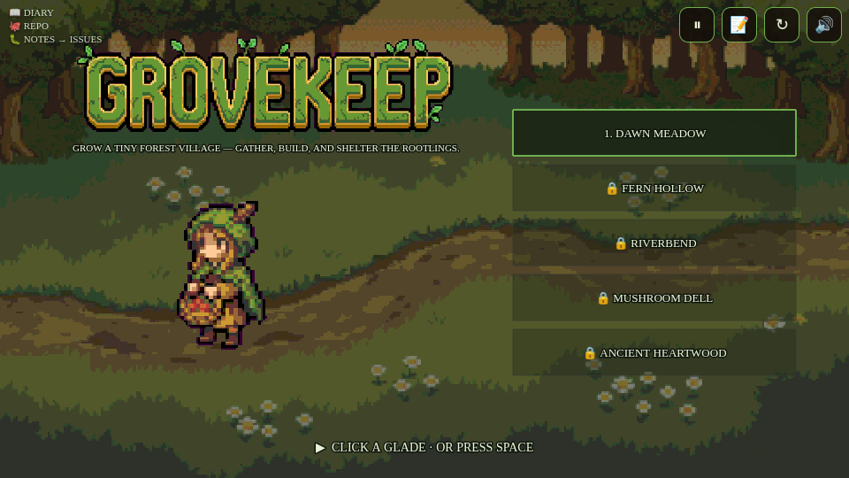
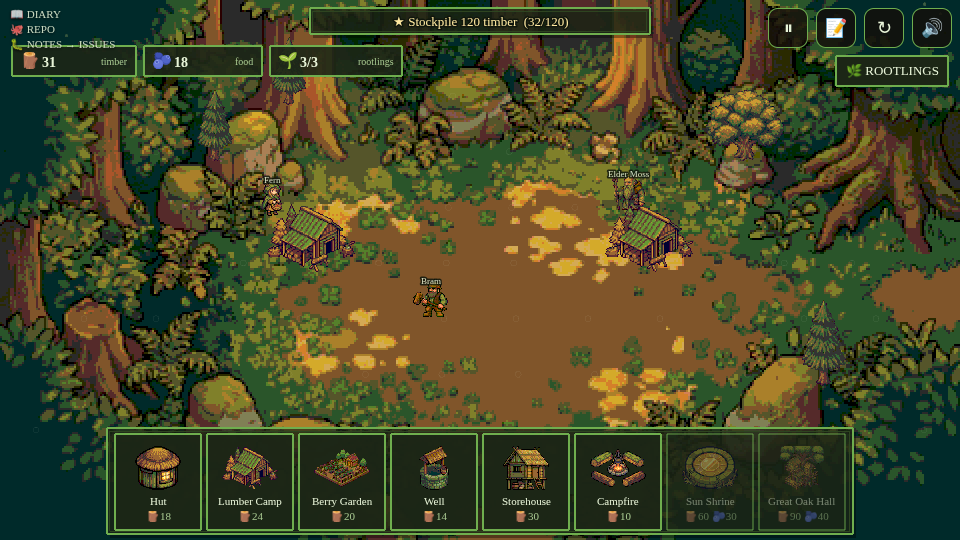
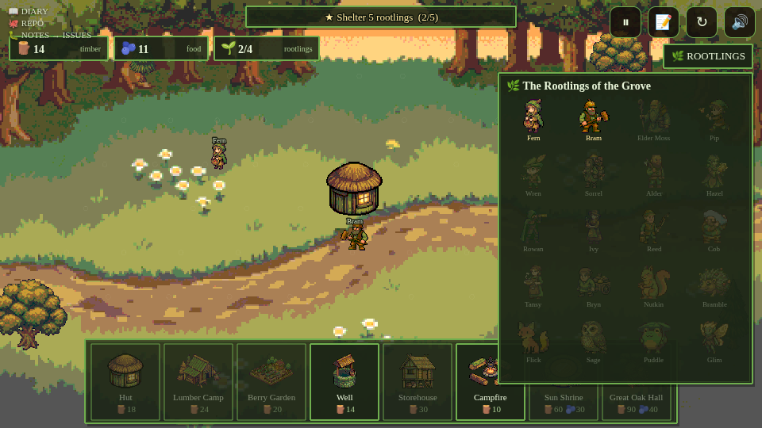

# Grovekeep — build diary

An isometric **pixel-art world-builder** — the engine's **5th genre**. A forest
glade, an economy of **timber and berries**, and twenty named **rootlings** who
join your village as you shelter and feed them. Five glades, each a settlement
scenario: grow a population, stockpile timber, or raise a landmark (the Sun
Shrine, the Great Oak Hall).

## Two engine investments this game funded
**`Studio.UI`** — the engine's first real UI kit (canvas-native, pixel-friendly,
themed): panels, buttons, **build-palette cards** (icon + cost + affordability
greying + selection), **animated resource bars**, and a follow-the-pointer
tooltip. Every future game inherits it.

**`Studio.Builder`** — the world-builder archetype on `Studio.Iso`: a glade
grid, placement ghost (green/red validity), a deterministic economy tick,
population growth gated by food, per-glade goals, and a **plan-driven autopilot**.

## Pixel art, systematically
Phaser's Pixel Studio is an interactive web app (no headless API), so the engine
got **`pixelize`** instead — a post-processor that turns any Gemini render into
genuine chunky pixel art (coarse-grid downscale → palette posterize → hard alpha
→ nearest-neighbour upscale). All 36 assets — **20 characters**, 10 structures,
5 glade backdrops, the wordmark — went through it for one cohesive 16-bit look.

## Win-by-construction, for a builder
No deaths here — the gate proves the **plan**: each glade's autopilot build order
must be *placeable* (in-grid, no overlaps), *affordable* (simulated under income,
built structures compounding their rates), and *goal-covering* (shelter + food
support the population target; the landmark is actually in the plan). That's the
`builder` contract in `rules.json` — checked statically by the lint in
milliseconds, then replayed bit-identically by the browser gate.

## Scorecard
- **Gate:** GREEN — deterministic, frame-identical **10100**, webgl + canvas.
- **Lint:** `builder` contract **29/29**.
- **Music:** five Lyria woodland themes, one per glade (per-level validator ✓).
- **Characters:** 20 named rootlings, all generated + pixelized, all in the roster.
