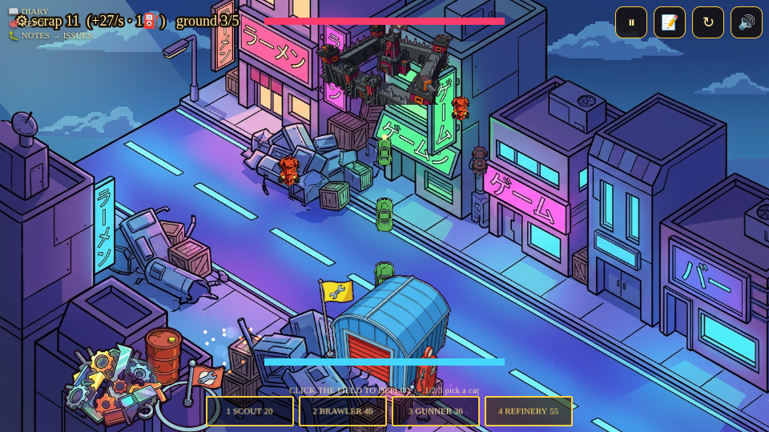
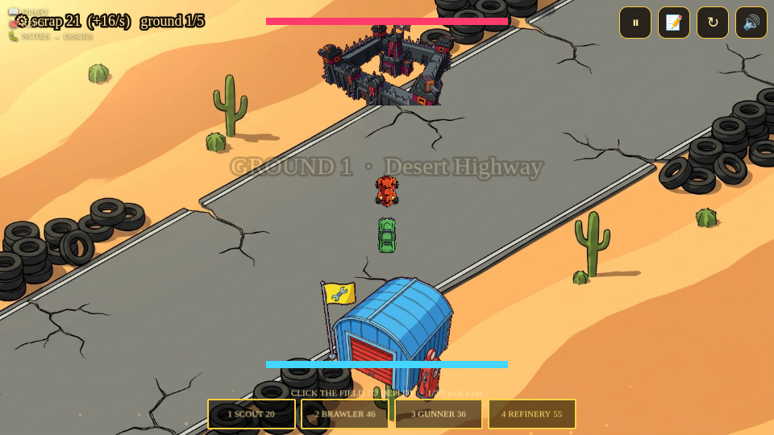

# Roadwar Iso — build diary

The **isometric redesign** of Roadwar — the engine's 4th archetype (`isorts`): the
same deterministic car-RTS economy on a FREER battlefield. No fixed lanes; you
deploy at any lateral spot of a perspective-projected 2.5D field (`Studio.Iso`,
the engine's reusable iso projector), depth-sorted so near cars draw bigger.

## What carried over (win-by-construction)
The lane index became a continuous `lx ∈ [-1,1]` with a lateral engage band —
the economy, turrets and the accumulation/side-leak bounds are unchanged, so the
0-death gate transferred: **deterministic, frame-identical (9005), all 5 grounds**.

## Systematic tension (not hand-tuned)
Each ground declares a `difficulty`; `Studio.rtsPressure` turns it into flank
waves, and `studio balance` auto-tuned the campaign to a rising tension curve —
**0.34 → 0.38 → 0.47 → 0.46 → 0.71** (comfortable → BRUTAL boss finale), with
**89% strategic diversity** across 7 AI playstyles (`studio strategies`).

## Scorecard
- **Gate:** GREEN — webgl + canvas, frame-identical (9005), 0 deaths.
- **Fun:** **91.7** (design 86.6 + polish 100) via the design lens.
- **Tension:** rises to a BRUTAL Warlord finale; 89% strategic diversity.
- **Shipped:** `agadabanka/roadwar-iso` (private) → deploys via GitHub →
  https://roadwar-iso-production.up.railway.app
- **Playtest fix:** "cars are tiny" (#1) — cars re-scaled ~3× for readability.
