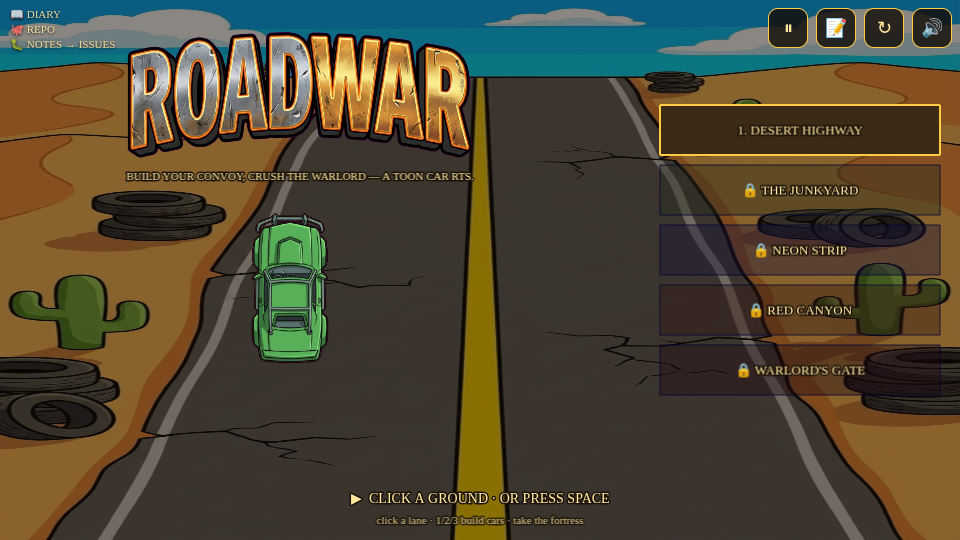
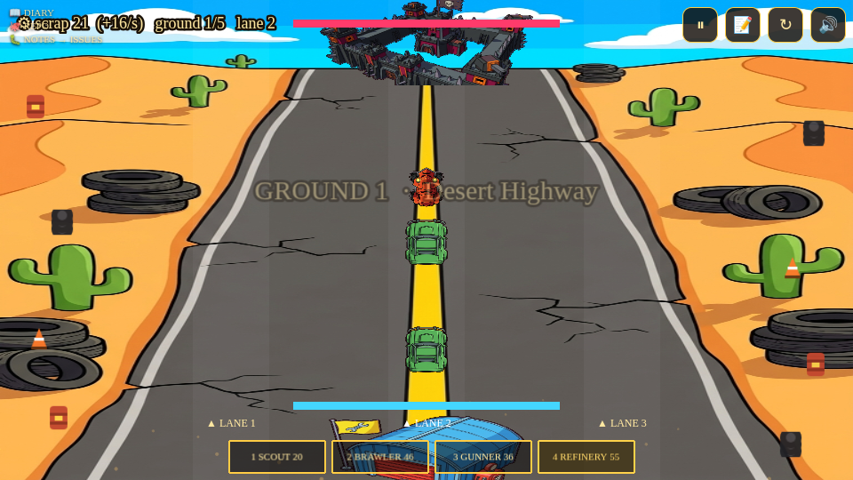

# Roadwar — build diary

A toon-shaded, car-themed **RTS** — the fourth archetype on the Studio/Phaser-4
engine (after the runner, the vertical climber, and the shooter). Five grounds:
your **garage** (bottom) vs a warlord **fortress** (top) across three lanes.
Spend auto-income **scrap** to **build** cars that drive up and brawl. Win =
fortress HP→0; lose = garage HP→0.

## The archetype: a new deterministic shape
`Studio.RTS` is a distinct game loop (no gravity/platforms) that reuses the
shared chrome (Shell / Save / Audio / Touch / harness / local menu). The hard
problem for every archetype is the **deterministic 0-death gate**: the autopilot
must clear all five grounds, replay bit-identically, and never lose the garage.

For an RTS that can't be a *geometry* guarantee — it's an **economic** one.
The autopilot goes **all-in on the rally lane** with one unit (`autoBuild`), and
two **static** bounds (in `studio/rules.json`, checked by `level-lint`) make that
win-by-construction:

- **Accumulation** — `income/cost > fortressTurret.dmg / (cd · hp)`: the player
  adds rally units faster than the fortress turret removes them, so the deathball
  grows without bound and the **finite** enemy schedule's fortress falls.
- **Side-leak** — every off-rally unit is a scout, and the cumulative chip of all
  side scouts (each cleared by the **all-lane** garage gun) stays under a garage-HP
  budget. So a flank never grinds the base down.

The roster is a real choice (lens #32): **scout** (cheap/fast), **brawler**
(tank, the rally pick), **gunner** (ranged), plus the enemy-only **warlord** boss.

## Tools invented for this game
- **`sim.mjs`** — a faithful pure-Node port of `tickWorld` + the autopilot. It
  proves a campaign 0-death in **milliseconds** (the browser gate takes minutes),
  so the economy was tuned offline; the browser gate then confirmed the **exact**
  frame count (9801) — proof the sim is faithful and the run deterministic.
- **`studio lens`** (`tools/design-lens/`) — a **design diagnostic** built on the
  platformer's lens path: **MDA** (trace the weak aesthetic to the mechanic) +
  **Jesse Schell's lenses**. It turns a low Feel number into the lens that asks
  *why* and a concrete, archetype-specific mechanic fix — and judges both per-level
  quality **and** campaign intensity escalation.

## Lens-driven design (FUN 65 → 86.3)
The lens diagnosed the weak components and prescribed real design, not scorer
tweaks:
- **#61 Interest Curve** — each ground is shaped **hook → waves with rests →
  climactic assault**, and the campaign **back-loads** to a boss.
- **#31 Challenge / #2 Surprise** — each ground has ONE signature
  (introduce→develop→twist→master): G1 basics · G2 a gunner standoff · G3 flank
  pincers · G4 brawler walls · **G5 the Warlord boss**.
- Intensity **escalates 9 → 22 → 22 → 32 → 45** to the boss finale.

## Scorecard
- **Gate:** GREEN — webgl + canvas, frame-identical (9801), 0 deaths, all five
  grounds, the boss fought.
- **Lint:** `rts` contract 100% (accumulation + side-leak bounds on every ground).
- **Fun:** **86.3** (bar 80) via the design lens.
- **Art:** toon cel-shaded (Gemini) — 5 grounds, 6 cars, garage + fortress, the
  Warlord boss, the ROADWAR wordmark. **Music:** Lyria battle anthem.
- **Shipped:** repo `agadabanka/roadwar` (private), notes→issues, hub-registered,
  deployed → https://roadwar-production.up.railway.app
